# Atharva Yanna

<picture>
  <source media="(prefers-color-scheme: dark)" srcset="./dark.svg">
  <source media="(prefers-color-scheme: light)" srcset="./light.svg">
  
</picture>

### Computer Science Graduate · Software Engineer · AI/ML Enthusiast

:::

------------------------------------------------------------------------

Computer Science graduate and technology professional with a strong
interest in **Artificial Intelligence, Machine Learning, and Systems
Engineering**.

I enjoy working on problems that sit between **software engineering,
intelligent systems, and real-world applications**. My foundation spans
algorithms, data structures, software design, backend development, and
modern web technologies.

I value continuous learning, practical implementation, and building
software that is useful, maintainable, and thoughtfully engineered.

------------------------------------------------------------------------

## `> technical_stack`

### Languages

### Web Development

### Data & ML

### Tools

------------------------------------------------------------------------

## `> connect`

:::

------------------------------------------------------------------------

::: {align="center"}
``{=html}Designed, built, and continuously improved with
curiosity.``{=html}
:::

<!--
## Hi there 👋
**atharva2408/atharva2408** is a ✨ _special_ ✨ repository because its `README.md` (this file) appears on your GitHub profile.

Here are some ideas to get you started:

- 🔭 I’m currently working on ...
- 🌱 I’m currently learning ...
- 👯 I’m looking to collaborate on ...
- 🤔 I’m looking for help with ...
- 💬 Ask me about ...
- 📫 How to reach me: ...
- 😄 Pronouns: ...
- ⚡ Fun fact: ...
-->
